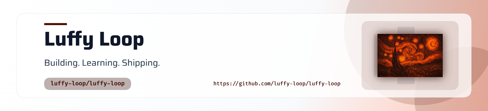

<picture>
  <source media="(prefers-color-scheme: dark)" srcset="./assets/header-light.png">
  <source media="(prefers-color-scheme: light)" srcset="./assets/header-light.png">
  
</picture>

 

# Hey there, I'm Poojasri - Welcome to Luffy-Loop!

 

&nbsp;

&nbsp;

---

## 👩‍💻 About Me

<table>
<tr>
<td width="68%">

I'm a **Computer Science student and developer** who enjoys turning ideas into practical software.

My interests span **software engineering, AI/ML, data-driven systems, algorithms, and systems programming**.

I enjoy learning how things work, experimenting with new technologies, and turning what I learn into real projects.

### What I enjoy

- Building practical software and developer tools
- Exploring AI/ML and data-driven systems
- Algorithms and problem solving
- Systems programming and understanding things under the hood
- Experimenting with new technologies
- Turning ideas into working projects

**Build → Learn → Experiment → Ship**

</td>

<td width="32%" align="center">

  

<b>Luffy Loop</b>

 

Building. Learning. Shipping.

</td>
</tr>
</table>

---

## 🛠️ Tech Stack

### Languages

  

### Development & Tools

  

---

## 🚀 Featured Projects

<table>
<tr>

<td width="50%" align="center">

### Synapse Studio

**Algorithm Visualization**

Interactive platform for visualizing and understanding algorithms.

 

  

</td>

<td width="50%" align="center">

### FraudLens

**Machine Learning**

Machine learning project focused on transaction analysis and fraud detection.

 

  

</td>

</tr>

<tr>

<td width="50%" align="center">

### OS Project

**Systems Programming**

Operating-system focused project exploring low-level programming and system concepts.

 

  

</td>

<td width="50%" align="center">

### Campus Pulse

**Full-Stack Development**

Campus-focused application built around practical student workflows.

 

  

</td>

</tr>
</table>

---

## 📊 GitHub Activity

**A visual summary of my journey on GitHub**

  

  

---

## 🐍 Contribution Snake

**My GitHub contribution activity, visualized as a snake.**

 

---

## 🎯 Current Focus

| 📚 Learning | 🔨 Building | 🔭 Exploring |
|:---:|:---:|:---:|
| Machine Learning | AI Projects | AI Engineering |
| AI & Data | Full-Stack Applications | Systems |
| DSA | Developer Tools | Open Source |
| Software Engineering | Practical Projects | New Technologies |

---

## 🤝 Let's Connect

&nbsp;

  

---

### Building. Learning. Shipping.

 

